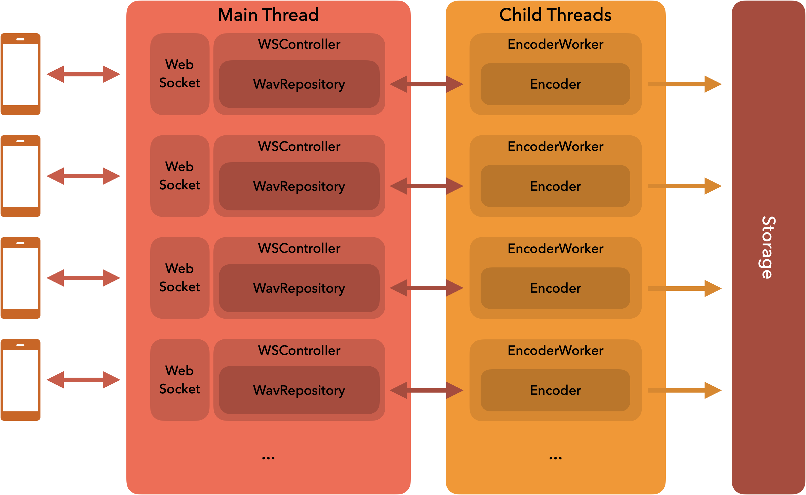
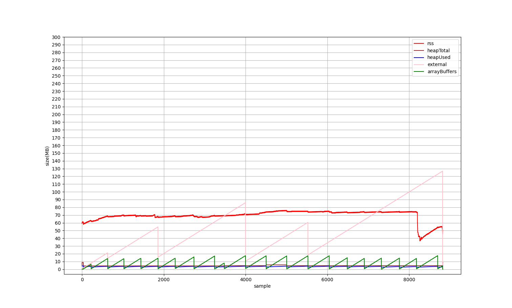

# audio-websocket-demo



Websocket audio streaming demo

## Memory Diagnose



Memory usage chart in normal running mode.

## Requirements

```plaintext
node 16.x
yarn 1.22.x
vue/cli
VSCode (Extensions-Volar/ESLint,,,)
```

## How to run

### [Client](src/client/)

Open project with `./src/client/`

`Run & debug ("vuejs: chrome") in VSCode`

or

```sh
yarn run serve
```

### [Server](src/server/)

Open project with `./src/server/`

`Run & debug ("start-server") in VSCode`

or

```sh
node ./bin/server
```
